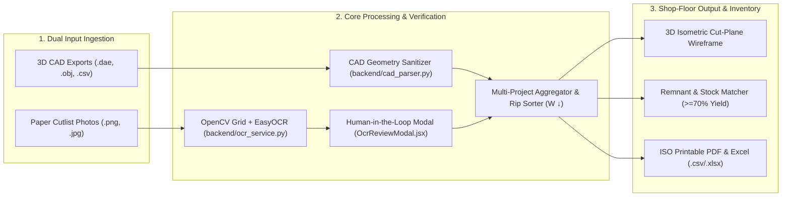

# System Architecture — Rome Cabinets Shop-Floor Coordinator

```mermaid
flowchart LR
  subgraph Intake["1. Dual Input Ingestion"]
    CAD["3D CAD Exports (.dae, .obj, .csv)"]
    OCR["Paper Cutlist Photos (.png, .jpg)"]
  end

  subgraph Processing["2. Core Processing & Verification"]
    SANITIZER["CAD Geometry Sanitizer (backend/cad_parser.py)"]
    OPENCV["OpenCV Grid + EasyOCR (backend/ocr_service.py)"]
    MODAL["Human-in-the-Loop Modal (OcrReviewModal.jsx)"]
    AGG["Multi-Project Aggregator & Rip Sorter (W ↓)"]
  end

  subgraph ShopFloor["3. Shop-Floor Output & Inventory"]
    WIRE["3D Isometric Cut-Plane Wireframe"]
    INV["Remnant & Stock Matcher (>=70% Yield)"]
    EXPORT["ISO Printable PDF & Excel (.csv/.xlsx)"]
  end

  CAD --> SANITIZER --> AGG
  OCR --> OPENCV --> MODAL --> AGG
  AGG --> WIRE
  AGG --> INV
  AGG --> EXPORT
```
